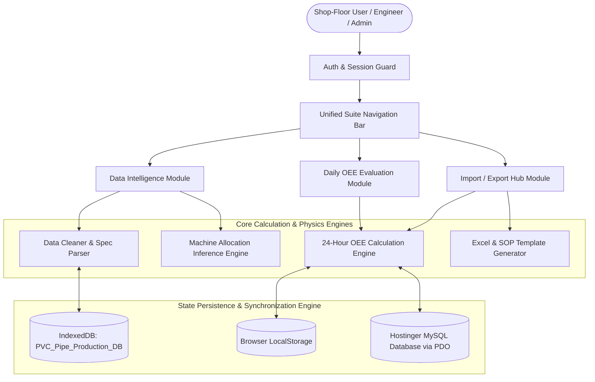
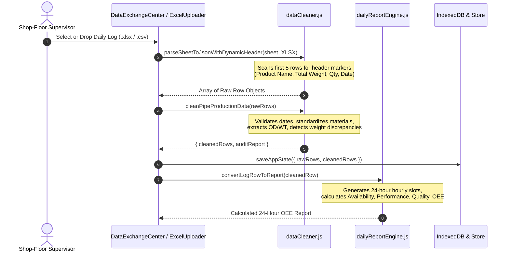
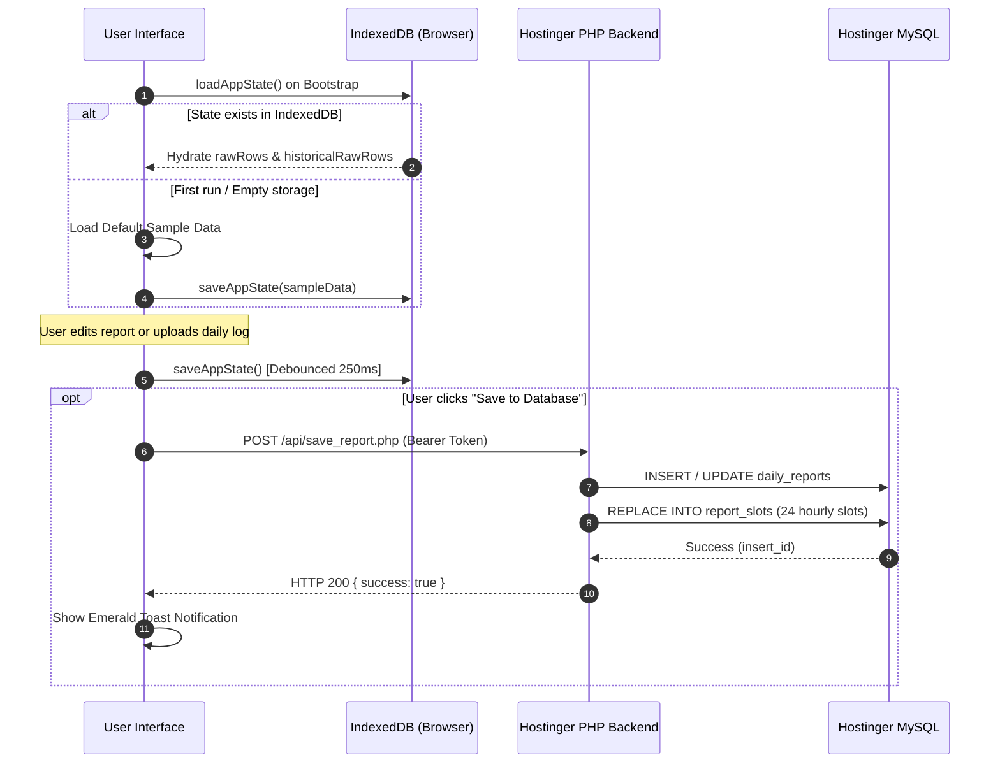
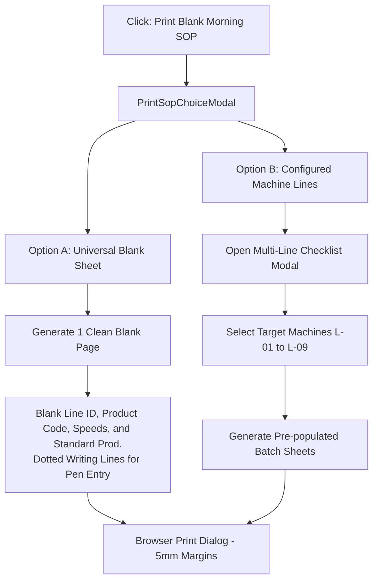

# SYSTEM ARCHITECTURE & OPERATIONAL DATA FLOW MANUAL
## Unified PVC Pipe Production Suite & Intelligence Platform
**Document Reference:** `SYSTEM_WORKFLOW_AND_DATA_FLOW.md`  
**Target Repository:** `https://github.com/khaledtaha-tech/pvc_pipe_production`  
**Branch:** `main`  
**System Classification:** Production Shop-Floor Execution, OEE Intelligence & Extrusion Engineering Suite  
**Document Version:** 1.0.0 (Production Release)

---

## 1. Unified Architecture & Navigation Map

### 1.1 Executive System Overview
The PVC Pipe Production Suite is an industrial-grade web application engineered for PVC/uPVC pipe extrusion factories. The platform bridges the gap between raw shop-floor logging, ERP historical runs, machine sizing physics, and executive OEE analytics.

The system consolidates three previously fragmented tools into a single, cohesive single-page application (SPA):
1. **Daily OEE Evaluation (`daily-evaluation`):** Real-time 24-hour shop-floor monitoring, shift handover tracking (Shift 1 & Shift 2), downtime categorization, and standard OEE computation.
2. **Data Intelligence (`data-analysis`):** Deep analytical modeling, cleaning audit reports, machine sizing envelope validation, dynamic ERP machine inference, and automated production planning.
3. **Import / Export Hub (`data-hub`):** Centralized data exchange center managing Excel log ingestion, standardized template downloads, shift SOP printing, and multi-format reporting.

---

### 1.2 System Architecture Diagram



---

### 1.3 State Management & Cross-Module Synchronization

The suite uses a multi-tier state architecture combining in-memory React state, persistent client-side storage, and remote database synchronization:

| Storage Layer | Technology | Primary Content | Lifetime / Scope | Sync Mechanism |
| :--- | :--- | :--- | :--- | :--- |
| **Volatile State** | React `useState` & `useMemo` | Active tab, modal toggles, calculation sandbox inputs, uncommitted row edits. | Browser session tab. | Unidirectional props & callbacks. |
| **Client Database** | IndexedDB (`PVC_Pipe_Production_DB`) | Cleaned daily log rows (`rawRows`), historical ERP rows (`historicalRawRows`), sheet name. | Permanent local device cache. | Debounced 250ms write on state mutation (`saveAppState`). |
| **Local Preferences** | Browser `localStorage` | Theme (`dark` / `light`), active language (`en` / `ar`), auth token (`pvc_auth_token`), local reports fallback. | Persistent across browser restarts. | Synchronous read on initialization. |
| **Relational Database** | Hostinger MySQL (`api/`) | User credentials, access roles, 24-hour daily reports (`daily_reports`), hourly slot records (`report_slots`). | Enterprise server storage. | RESTful JSON HTTP calls with Bearer Token authentication. |

#### The "Dual-State Mounted Strategy" in `App.jsx`
A key design principle of the application is the **Dual-State Mounted Strategy**:
- When switching to `currentModule === 'data-hub'` or `data-analysis`, the `<DailyEvaluationView>` component is **NOT unmounted**.
- Instead, it is retained in the DOM with CSS visibility toggling (`display: block` vs `display: hidden`).
- **Rationale:**
  1. Prevents loss of uncommitted shop-floor hourly records when supervisors navigate to download templates or view analytics.
  2. Guarantees that the `dailyEvalRef` exposed via `useImperativeHandle` remains continuously accessible to the `Navbar` and the `DataExchangeCenter`.
  3. Enables the Import / Export Hub to trigger instant exports (`exportSingleExcel`, `exportAllExcel`, `exportDateRange`) and print dialogs (`openBlankSopPrint`) directly from the evaluation state without re-instantiating the component.

---

## 2. Button-by-Button & Action Directory

This directory catalogues every actionable button, modal trigger, and interactive control across the entire platform.

### 2.1 Top Navigation Bar (`src/components/common/Navbar.jsx`)

| Button / Control | Location | Function Triggered | Expected Input | Output / State Changed | Target User & Rationale |
| :--- | :--- | :--- | :--- | :--- | :--- |
| **Brand Logo & Title** | Navbar (Top Left) | Navigation Reset | Click event | Resets view to primary dashboard (`data-analysis` / `master`). | All users: quick return to home screen. |
| **Data Intelligence Tab** | Navbar Module Switcher | `setCurrentModule('data-analysis')` | Click event | Displays analytical tables, charts, sizing audits, and planning matrix. | Planning Engineer: evaluate plant efficiency and allocation. |
| **Daily OEE Evaluation Tab** | Navbar Module Switcher | `setCurrentModule('daily-evaluation')` | Click event | Displays 24-hour shift evaluation sheet, hourly slots, and OEE meters. | Shift Supervisor: log hourly pipe counts, scrap, and downtime. |
| **Import / Export Hub Tab** | Navbar Module Switcher | `setCurrentModule('data-hub')` | Click event | Opens unified center for all uploads, downloads, templates, and backups. | Plant Manager & Supervisor: centralized file operations. |
| **Master Table Sub-tab** | Sub-nav (Data Intelligence) | `setActiveTab('master')` | Click event | Displays multi-column cleaned master extrusion runs. | Production Engineer: review validated runs. |
| **Dashboard Sub-tab** | Sub-nav (Data Intelligence) | `setActiveTab('dashboard')` | Click event | Displays KPI summary cards and dynamic graphical charts. | Executive Management: high-level plant performance review. |
| **Audit & Cleaning Sub-tab** | Sub-nav (Data Intelligence) | `setActiveTab('audit')` | Click event | Displays data anomaly detection and auto-correction logs. | Quality Engineer: verify input data integrity. |
| **Planning Matrix Sub-tab** | Sub-nav (Data Intelligence) | `setActiveTab('planning')` | Click event | Displays machine allocation matrix and profile recommendations. | Production Planner: assign pipe recipes to optimal extruders. |
| **Verification Engine Sub-tab** | Sub-nav (Data Intelligence) | `setActiveTab('verification')` | Click event | Displays automated test suite and golden scenario benchmarks. | Software Engineer: verify calculation accuracy. |
| **Manual Entry Button** | Sub-nav Actions | `setIsManualModalOpen(true)` | Click event | Opens modal dialog to manually add a single production log row. | Supervisor: input run without uploading an Excel file. |
| **Export Clean Button** | Sub-nav Actions | `handleExportCleanExcel()` | Valid `cleanedRows` | Downloads sanitized Excel log (`Cleaned_Production_Log_YYYY-MM-DD.xlsx`). | Quality Control: store clean tabular records. |
| **Export Master Plan Button** | Sub-nav Actions | `handleExportMasterPlanExcel()` | Valid `unifiedMasterRuns` | Downloads 18-column Excel workbook (`Master_Extrusion_Plan_YYYY-MM-DD.xlsx`). | Planner: distribute finalized extrusion schedules. |
| **Print Blank Morning SOP** | Sub-nav Action (Daily Eval) | `onOpenBlankSopPrint()` | Click event | Opens `PrintSopChoiceModal` to select Universal Blank or Batch Mode. | Supervisor: print paper forms for shop-floor operators. |
| **Save All / Global Save** | Header Right Controls | `handleGlobalSave()` | Active records / report | Flushes data to IndexedDB or sends report to MySQL via `/api/save_report.php`. | Supervisor: persist shift work to server and local database. |
| **Language Toggle** | Header Right Controls | `setLang(lang === 'ar' ? 'en' : 'ar')` | Click event | Switches application locale between English and Arabic. | All users: bilingual accessibility. |
| **Theme Toggle** | Header Right Controls | `toggleTheme()` | Click event | Toggles light and dark visual themes (`bg-slate-950` vs `bg-[#f2eee7]`). | All users: visual ergonomics in varying factory lighting. |
| **User Profile / Admin** | Header Right Controls | `setIsAdminModalOpen(true)` | Admin role required | Opens Admin User Management Modal dialog. | System Admin: manage operator accounts and permissions. |
| **Logout Button** | Header User Dropdown | `logout()` | Click event | Clears JWT session token and redirects to Login screen. | All users: secure workstation exit. |

---

### 2.2 Import / Export Hub (`src/components/data-hub/DataExchangeCenter.jsx`)

#### Section 1: Ingestion & Uploads (Input Data)
- **Upload Daily Production Log Dropzone:**
  - *Trigger:* `dailyFileInputRef.current.click()` or Drag & Drop.
  - *Expected Input:* `.xlsx`, `.xls`, `.csv` containing shop-floor runs.
  - *State Update:* Parses workbook with `parseSheetToJsonWithDynamicHeader`, populates `rawRows`, triggers IndexedDB sync.
  - *Rationale:* Ingests daily operator records from Excel.
- **Upload Historical ERP Log Dropzone:**
  - *Trigger:* `erpFileInputRef.current.click()` or Drag & Drop.
  - *Expected Input:* Legacy ERP spreadsheets with item codes, pipe specs, and historical tonnages.
  - *State Update:* Populates `historicalRawRows`, executes Machine Inference Engine.
  - *Rationale:* Ingests historical data to calibrate machine allocation models.
- **Load Screenshot Sample (59 Runs):**
  - *Trigger:* `setRawRows(SAMPLE_PRODUCTION_DATA)`.
  - *Expected Input:* Embedded standard sample dataset.
  - *State Update:* Replaces active raw rows with 59 production runs.
  - *Rationale:* Enables instant system demonstration and offline testing.
- **Load 15-Run ERP Sample:**
  - *Trigger:* `setHistoricalRawRows(SAMPLE_HISTORICAL_ERP_DATA)`.
  - *Expected Input:* Embedded ERP sample dataset.
  - *State Update:* Replaces active ERP records with 15 historical runs.
  - *Rationale:* Evaluates sizing inference without external files.
- **Clear All Datasets:**
  - *Trigger:* `onClearAllData()` -> `setIsClearDialogOpen(true)`.
  - *Expected Input:* Confirmation dialog click.
  - *State Update:* Empties `rawRows`, `historicalRawRows`, and clears IndexedDB.
  - *Rationale:* Resets the workspace before loading a new production batch.

#### Section 2: Templates & Blank Forms (Downloads)
- **Download Daily Production Log Template (Excel):**
  - *Trigger:* `generateDailyProductionLogTemplate()`.
  - *Output:* Generates `Daily_Production_Log_Template.xlsx` with standard 15 columns, column instructions, and 3 example rows.
  - *Target User:* Plant Supervisor to distribute standardized Excel files to shop-floor computers.
- **Download ERP Formatting Template (Excel):**
  - *Trigger:* `generateErpImportTemplate()`.
  - *Output:* Generates `ERP_Historical_Import_Template.xlsx` with 9 standard columns.
  - *Target User:* IT / ERP Administrator to export data in the format expected by the inference engine.
- **Download Engineering Calculation Guide (Excel):**
  - *Trigger:* `generateCalculationGuideWorkbook()`.
  - *Output:* Generates `PVC_Extrusion_Calculation_Guide.xlsx` detailing mathematical equations and pipe sizing charts.
  - *Target User:* Process Engineer for reference on line speeds, cut times, and theoretical weights.

#### Section 3: Shift SOP & Inspection Printing
- **Print Blank Morning SOP (DOC-Ext.-03):**
  - *Trigger:* `onOpenBlankSopPrint()`.
  - *Output:* Triggers modal providing Choice A (Universal Blank Sheet) and Choice B (Batch Mode).
  - *Target User:* Shift Supervisor at the start of the morning shift (06:30).
- **Date Selector & Machine Filter:**
  - *Trigger:* Select input change (`setSelectedPrintDate`, `setSelectedMachineLine`).
  - *Output:* Filters print targets to a specific machine line (`L-01` to `L-09`) or `ALL`.
- **Quick Print / PDF Export:**
  - *Trigger:* `window.print()`.
  - *Output:* Browser native print dialog optimized via `@media print`.

#### Section 4: Data Exports & Backups
- **Export Current Line (Excel):**
  - *Trigger:* `dailyEvalRef.current.exportSingleExcel()`.
  - *Output:* Single-machine formatted 24-hour evaluation workbook (`Daily_Report_YYYY-MM-DD_Line.xlsx`).
- **Export All Lines (Excel):**
  - *Trigger:* `dailyEvalRef.current.exportAllExcel()`.
  - *Output:* Multi-sheet workbook (`Daily_Reports_YYYY-MM-DD_All_Machines.xlsx`) containing `Plant_Summary` plus one sheet per active line.
- **Export Date Range (Excel):**
  - *Trigger:* `dailyEvalRef.current.exportDateRange(rangeStartDate, rangeEndDate)`.
  - *Output:* Comprehensive date-range consolidated workbook.
- **Export Master Extrusion Plan (Excel):**
  - *Trigger:* `onExportMasterPlan()`.
  - *Output:* 18-column technical extrusion plan workbook.
- **Export Unique Planning Catalog:**
  - *Trigger:* `onExportUniqueCatalog()`.
  - *Output:* Deduplicated planning catalog organized by pipe diameter.
- **Full System Snapshot (JSON):**
  - *Trigger:* `handleExportJsonSnapshot()`.
  - *Output:* Timestamped `.json` file containing complete application memory, settings, and records.

#### Section 5: Code Analysis & Calculation Inspector
- **Interactive Sandbox Inputs:**
  - Sliders & Number inputs: Speed (m/min), Cut Length (m), Outer Diameter (mm), Wall Thickness (mm), Operating Hours (h).
  - *Output:* Live calculation updates for Linear Weight (kg/m), Piece Weight (kg), Throughput (kg/h), Pieces/Hour, and Loading Ratio (%).

---

### 2.3 Daily OEE Evaluation Screen (`src/components/daily-evaluation/DailyEvaluationView.jsx`)

| Button / Control | Location | Function Triggered | Output / State Changed |
| :--- | :--- | :--- | :--- |
| **Date Input** | Header Bar | `handleDateChange(e.target.value)` | Loads or creates report state for selected calendar date. |
| **Machine Line Select** | Header Bar | `handleLineChange(e.target.value)` | Switches active extruder line (`L-01` to `L-09`). |
| **Tab: Shift Sheet** | View Switcher | `setTab('sheet')` | Displays 24-hour hourly slot table and OEE cards. |
| **Tab: Plant Analytics** | View Switcher | `setTab('analytics')` | Displays plant-wide cross-machine operational summary. |
| **Tab: Legacy SOP** | View Switcher | `setTab('sop')` | Renders official `DOC-Ext.-03` inspection sheet. |
| **Upload Daily Log** | Actions Strip | `setIsUploaderOpen(true)` | Opens slide-over drawer to upload shop-floor Excel files. |
| **Export Excel** | Actions Strip | `setIsExportModalOpen(true)` | Opens modal to export single, multi-line, or range reports. |
| **Print SOP / Sheet** | Actions Strip | `setIsPrintChoiceModalOpen(true)` | Opens print selector modal. |
| **History Drawer Button** | Actions Strip | `setIsHistoryOpen(true)` | Opens list of historical reports fetched from MySQL. |
| **Save to Database** | Actions Strip | `handleSave()` | Sends JSON payload to `api/save_report.php` and updates local store. |
| **Laser Monochrome Mode** | Actions Strip | `setIsLaserMonochrome(!isLaserMonochrome)` | Toggles high-contrast black-and-white theme for mono laser printers. |
| **Apply Downtime Events** | Shift Summary | `applyDowntimeEvents()` | Maps discrete downtime minutes into corresponding hourly slots. |
| **Distribute Production** | Shift Summary | `distributeProduction()` | Distributes total output across running slots proportional to run time. |

---

### 2.4 Data Intelligence Screen (`src/components/data-analysis/DataAnalysisView.jsx`)

| Button / Control | Location | Function Triggered | Output / State Changed |
| :--- | :--- | :--- | :--- |
| **Machine Filter Dropdown** | Master Extrusion Table | `setSelectedMachine(e.target.value)` | Filters table rows to selected extruder. |
| **Material Filter Dropdown** | Master Extrusion Table | `setSelectedMaterial(e.target.value)` | Filters table rows to `uPVC`, `HDPE`, `PPR`, or `CPVC`. |
| **Sizing Status Filter** | Master Extrusion Table | `setSizingFilter(e.target.value)` | Filters rows by `Optimal`, `Suboptimal`, `Violation`, etc. |
| **Search Query Input** | Master Extrusion Table | `setSearchQuery(e.target.value)` | Performs full-text search across product codes and descriptions. |
| **Row Details Toggle** | Master Extrusion Table | `toggleRowExpansion(row.id)` | Expands accordion showing envelope diagnostics and audit adjustments. |
| **Run All Verification Suites**| Verification Center | `handleRunAllTests()` | Executes scenario runner, golden case benchmarks, and updates pass/fail counters. |

---

### 2.5 Admin User Management Screen (`src/components/admin/AdminUserManagementModal.jsx`)

| Button / Control | Function Triggered | Expected Input | Output / State Changed |
| :--- | :--- | :--- | :--- |
| **Add New User Button** | `handleOpenCreateModal()` | New user details (username, password, role, expiry). | Sends `POST` request to `api/users.php`, updates user table. |
| **Edit User Button** | `handleOpenEditModal(user)` | Modified user role, password, or expiration date. | Sends `PUT` request to `api/users.php`. |
| **Toggle Status (Active/Inactive)** | `handleToggleUserStatus(user)` | Click on status badge. | Updates `is_active` flag in database; disables login if inactive. |
| **Delete User Button** | `handleDeleteUser(user.id)` | Confirmation modal click. | Sends `DELETE` request to `api/users.php`, removes user row. |

---

## 3. Data Flow & Ingestion Workflows

### 3.1 Workflow A: Shop-Floor Daily Production Log Ingestion



#### Detailed Ingestion Steps
1. **Dynamic Header Scanning (First 5 Rows Scan):**
   - Factory Excel sheets frequently include company logos, title blocks, or document metadata in rows 1 to 4.
   - The parser inspects rows 0 through 4 looking for standard header keywords: `product name`, `product code`, `totalweight`, `total weight`, `doc date`, `docdate`, `qty`, `unit weight`, `weight`, `date`.
   - The first row containing any match is established as the header row (`headerRowIndex`). Subsequent rows are parsed into key-value objects mapped to these headers.
2. **Column Matching Heuristics (`matchColumns`):**
   - Handles variable naming conventions:
     - `Date`: matches `docdate`, `date`, `day`, `doc date`.
     - `Item Code`: matches `productcode`, `itemcode`, `code`, `item_no`.
     - `Product Description`: matches `productname`, `description`, `itemdescription`.
     - `Production Quantity`: matches `qty`, `quantity`, `productionqty`.
     - `Unit Weight`: matches `unitweight`, `unitwt`, `weight` (strictly avoids `totalweight`).
     - `Total Weight`: matches `totalweight`, `totalwt`, `total weight`.
     - `Machine`: matches `machinename`, `machine`, `line`, `extruder`.
     - `Scrap`: matches `scrap`, `rejection`, `waste`.
     - `Operating Hours`: matches `operatinghours`, `runhours`, `hours`.
     - `Reason of Stop`: matches `reason`, `downtime`, `stop`, `remarks`.
3. **Data Cleansing & Mathematical Validation:**
   - **Date Normalization:** Resolves Excel serial dates (e.g., `45542`), ISO strings, and slash formats (`DD/MM/YYYY`, `MM/DD/YYYY`) into `YYYY-MM-DD`.
   - **Material Standardization:** Normalizes variations (`PVC`, `uPVC`, `UPVC`, `PVC-U`) into `uPVC`. Preserves `HDPE`, `PPR`, and `CPVC`.
   - **Dimensional Extraction (`parseProductSpecs`):**
     - Extracts metric diameters and thicknesses (e.g., `110x5.3` -> `OD: 110mm`, `WT: 5.3mm`).
     - Extracts imperial dimensions (e.g., `4" PIPE SDR 26` -> `OD: 4" (114.3mm)`, `WT: SDR 26`).
     - Filters out blacklisted standard numbers (`1785`, `2241`, `1452`, `3587`) from being misidentified as diameters.
   - **Weight Verification:** Compares recorded `Total Weight` against `Production Qty × Unit Weight`. Discrepancies exceeding 5 kg are flagged as warnings in the audit report.
   - **Scrap Ratio Validation:** Computes `Scrap % = (Scrap / (Total Weight + Scrap)) × 100`. Values exceeding 5.0% trigger an audit warning.

---

### 3.2 Workflow B: Legacy / Historical ERP Ingestion & Machine Inference

```mermaid
flowchart TD
    RawERP[Raw Historical ERP Excel] --> Parser[Dynamic Sheet Parser]
    Parser --> SpecParser[Product Specs & OD Extractor]
    SpecParser --> FilterJunk{Is Valid Pipe/Conduit?}
    
    FilterJunk -- No (Compound/Jacket/Unknown) --> Exclude[Exclude from Extrusion Planning]
    FilterJunk -- Yes --> EnvelopeFilter[Physical Machine Envelope Filter]
    
    subgraph MachineProfiles [Factory Extruder Database]
        L02[L-02: KTS 250 TDH (20-50mm)]
        L03[L-03: KTS 700 (110-400mm)]
        L04[L-04: KTS 200 (25-63mm)]
        L05[L-05: KTS 350 (75-160mm)]
        L06[L-06: Kabra 90 (110-200mm)]
        L07[L-07: KTS 170 (20-75mm)]
        L08[L-08: KTS 350 TDH (25-75mm)]
    end
    
    EnvelopeFilter <--> MachineProfiles
    EnvelopeFilter --> Candidates[Candidate Extruders Inside Envelope]
    Candidates --> Scoring[Calculate Loading Ratio & Rank Score]
    Scoring --> Allocation[Assign Primary Machine + 2 Alternatives]
```

#### Sizing & Machine Allocation Rules
The inference engine evaluates candidate extruders using physical feasibility and operating efficiency:
1. **Physical Envelope Constraint:**
   - The pipe diameter must strictly satisfy:
     \[
     \text{minDiameter} \le OD \le \text{maxDiameter}
     \]
   - Compounding lines (`L-01: KTS 550` and `L-09: Bausano`) are **strictly excluded** from pipe extrusion candidates.
2. **Capacity Loading Ratio Scoring:**
   - For each physically eligible machine, the engine computes:
     \[
     \text{Loading Ratio (\%)} = \left(\frac{\text{Actual Rate (kg/h)}}{\text{Nominal Machine Capacity (kg/h)}}\right) \times 100
     \]
   - Ideal Operating Envelope: **65% to 95%** (sweet spot centered at 80%).
   - Ranking Score Equation:
     - If \(65\% \le \text{Ratio} \le 95\%\):  
       \(\text{Score} = 100 - |\text{Ratio} - 80| + \text{SpecializationBonus}\)
     - If \(\text{Ratio} < 65\%\) (Derated):  
       \(\text{Score} = 50 - (65 - \text{Ratio})\)
     - If \(95\% < \text{Ratio} \le 110\%\) (Heavy Load):  
       \(\text{Score} = 40 - (\text{Ratio} - 95)\)
     - If \(\text{Ratio} > 110\%\) (Overloaded):  
       \(\text{Score} = \max(0, 20 - |\text{Ratio} - 80| \times 0.5)\)
3. **Primary & Alternative Assignment:**
   - The machine with the highest ranking score is assigned as `Inferred Machine (Primary)`.
   - Second and third highest-scoring machines are assigned as `Alternative 1` and `Alternative 2`.

---

### 3.3 Workflow C: Data Persistence & Synchronization



#### Backend REST API Interface Summary

| Endpoint | Method | Purpose | Authentication | Payload / Parameters |
| :--- | :--- | :--- | :--- | :--- |
| `api/login.php` | `POST` | Authenticate operator / manager | Public | `{ username, password }` |
| `api/save_report.php` | `POST` | Persist 24-hour report and hourly slots | Bearer Token | Complete report JSON payload |
| `api/get_report.php` | `GET` | Fetch single report by date and line | Bearer Token | `?date=YYYY-MM-DD&line_id=L-XX` |
| `api/get_history.php` | `GET` | Fetch list of archived reports | Bearer Token | `?limit=50&offset=0` |
| `api/delete_report.php` | `POST` | Delete archived report | Bearer Token (Manager/Admin) | `{ report_id }` |
| `api/users.php` | `GET` | List all users | Bearer Token (Admin) | None |
| `api/users.php` | `POST` | Create new user account | Bearer Token (Admin) | `{ username, password, role, ... }` |
| `api/users.php` | `PUT` | Update user role / password | Bearer Token (Admin) | `{ id, role, password, is_active }` |
| `api/users.php` | `DELETE` | Delete user account | Bearer Token (Admin) | `{ id }` |

---

## 4. Engineering Calculations & Formulas Reference

### 4.1 Physical Machine Master Profiles

| Line ID | Extruder Model | Nominal Capacity | Calibrated OD Range | Line Classification |
| :--- | :--- | :--- | :--- | :--- |
| **L-01** | KTS 550 | 400 kg/h | N/A (Compounding) | Pelletizing & Compounding Line |
| **L-02** | KTS 250 TDH | 200 kg/h | 20 mm – 50 mm | Twin-Die Small Diameter Pipe |
| **L-03** | KTS 700 | 500 kg/h | 110 mm – 400 mm | Large Diameter Sewage & Pressure Pipe |
| **L-04** | KTS 200 | 200 kg/h (180 actual) | 25 mm – 63 mm | Medium-Small Conduit & Pipe |
| **L-05** | KTS 350 | 330 kg/h (290 actual) | 75 mm – 160 mm | Medium Diameter Distribution Pipe |
| **L-06** | Kabra 90 | 380 kg/h | 110 mm – 200 mm | Heavy-Duty Pressure Pipe |
| **L-07** | KTS 170 | 150 kg/h (135 actual) | 20 mm – 75 mm | Small Conduit & Electrical Duct |
| **L-08** | KTS 350 TDH | 300 kg/h | 25 mm – 75 mm | Twin-Die High Output Small Pipe |
| **L-09** | Bausano | 1100 kg/h | N/A (Compounding) | High-Capacity Pelletizing Compounder |

---

### 4.2 Mathematical Formulas Reference

#### 1. Extrusion Cycle Time & Piece Production Rate
- **Theoretical Cut Time per Pipe (seconds):**
  \[
  T_{\text{cut}} = \left(\frac{L}{v}\right) \times 60
  \]
  *Where:*  
  \(L\) = Pipe Cut Length (meters, standard = 6.0 m)  
  \(v\) = Line Haul-off Speed (meters per minute)

- **Standard Pieces per Hour:**
  \[
  \text{Pieces/hr} = \frac{v \times 60}{L} = \frac{3600}{T_{\text{cut}}}
  \]

---

#### 2. Theoretical Pipe Linear Weight & Piece Mass
- **Theoretical Linear Weight (\(\text{kg/m}\)):**
  \[
  W_{\text{linear}} = \frac{\pi \times (OD - WT) \times WT \times \rho}{1000}
  \]
  *Where:*  
  \(OD\) = Outer Diameter (mm)  
  \(WT\) = Wall Thickness (mm)  
  \(\rho\) = Rigid uPVC Density Constant (\(1.43 \text{ g/cm}^3\) or \(\text{kg/dm}^3\))  
  \((OD - WT) \times \pi\) = Mean wall circumference (mm)  
  Divided by 1000 converts \(\text{mm}^3\) cross-sectional volume into \(\text{kg/m}\).

- **Standard Piece Weight (\(\text{kg/piece}\)):**
  \[
  W_{\text{piece}} = W_{\text{linear}} \times L
  \]

---

#### 3. Mass Extrusion Throughput Rate
- **Extrusion Throughput from Line Speed (\(\text{kg/h}\)):**
  \[
  \dot{m} = \text{Pieces/hr} \times W_{\text{piece}} = v \times 60 \times W_{\text{linear}}
  \]

- **Actual Recorded Shop-Floor Throughput Rate (\(\text{kg/h}\)):**
  \[
  \dot{m}_{\text{actual}} = \frac{W_{\text{total}}}{T_{\text{operating}}}
  \]
  *Where:*  
  \(W_{\text{total}}\) = Total finished production weight recorded in shift (kg)  
  \(T_{\text{operating}}\) = Active operating hours (\(24 - \text{Total Downtime Hours}\))

---

#### 4. Machine Capacity Utilization & Envelope Classification
- **Capacity Utilization Percentage:**
  \[
  \eta_{\text{capacity}} = \left(\frac{\dot{m}_{\text{actual}}}{\text{Nominal Capacity}}\right) \times 100
  \]

- **Classification Rules:**
  - **Optimal Loading:** \(65\% \le \eta_{\text{capacity}} \le 95\%\) (Emerald badge).
  - **Suboptimal / Derated:** \(\eta_{\text{capacity}} < 65\%\) (Amber badge).
  - **Heavy / Overloaded:** \(\eta_{\text{capacity}} > 95\%\) (Warning alert).
  - **Range Violation:** \(OD < \text{minDiameter}\) OR \(OD > \text{maxDiameter}\) (Rose badge).
  - **Pelletizing Line (Exempt):** Compounding lines L-01 and L-09 are exempt from diameter range checks (Purple badge).

---

#### 5. Overall Equipment Effectiveness (OEE)
- **1. Availability Rate (\(A\)):**
  \[
  A = \frac{T_{\text{operating}}}{T_{\text{planned}}} = \frac{24 - (\text{Total Downtime Minutes} / 60)}{24}
  \]
- **2. Performance Rate (\(P\)):**
  \[
  P = \frac{\text{Total Actual Pieces Produced}}{\text{Total Target Pieces Expected}}
  \]
  *Where target pieces for each hourly slot \(i\) is:*
  \[
  \text{Target}_i = \frac{\text{Standard Rate (pcs/h)} \times (60 - \text{Downtime Minutes}_i)}{60}
  \]
- **3. Quality Rate (\(Q\)):**
  \[
  Q = \frac{\text{Good Pieces}}{\text{Total Actual Pieces}} = \frac{\text{Total Actual Pieces} - \text{Total Scrap Pieces}}{\text{Total Actual Pieces}}
  \]
- **4. Overall OEE:**
  \[
  \text{OEE} = A \times P \times Q
  \]
  *Formatted in the UI as:* `OEE = A (XX.X%) × P (XX.X%) × Q (XX.X%) = XX.X%`

---

## 5. Printing & Export Operations

### 5.1 Standard Operating Procedure DOC-Ext.-03 Printing

The platform implements the official plant standard shift monitoring sheet: **`DOC-Ext.-03` (Version 04, Status: Standardized)**.

#### Two Operational Print Modes
When clicking **"Print Blank Morning SOP (DOC-Ext.-03)"**, the user is presented with two distinct workflows:



1. **Option A: Universal Blank Sheet (Single Template):**
   - Generates **exactly 1 page** formatted for physical print.
   - Leaves Line No, Product Code, Pipe Specification, Reference Speeds, Cut Times, Date, and Standard Production (Pcs) blank.
   - Provides clean horizontal dotted lines for shop-floor supervisors to write parameters with a pen during morning lineup.
2. **Option B: Configured Machine Lines (Current Batch Mode):**
   - Opens the machine checklist dialog to select any or all of the 9 production lines.
   - Pre-fills line ID, machine name, active product code, reference haul-off speeds, and standard hourly targets.
   - Automatically breaks pages cleanly per machine (`break-after: page`).

#### Precision Print CSS & Spacing Optimization
To eliminate bottom whitespace on A4 sheets, the print subsystem enforces:
```css
@media print {
  @page {
    size: A4 portrait;
    margin: 5mm;
  }
  body {
    background: #ffffff !important;
    color: #000000 !important;
  }
  .legacy-sop-sheet {
    min-height: 98vh;
    display: flex;
    flex-direction: column;
    justify-content: space-between;
    break-after: page;
    page-break-after: always;
  }
  .hourly-table tbody tr {
    height: 28px !important; /* Dynamically expands table rows to fill page */
  }
}
```

---

### 5.2 Excel Export Workbook Architectures

The suite provides six specialized Excel export generators implemented via the `xlsx` library:

| Export Type | Function Name | Columns / Structure | Key Target Sheets |
| :--- | :--- | :--- | :--- |
| **Single Machine Report** | `exportSingleMachineToExcel` | 7-column hourly log + 11-row header + OEE summary + Sign-offs. | `[Line_ID]` (e.g. `L-05`) |
| **All Machines Combined** | `exportAllMachinesToExcel` | Consolidated summary (17 columns) + Individual 24h tabs per operating line. | `Plant_Summary`, `L-02`, `L-03`, `L-05`, etc. |
| **Date Range Multi-Day** | `exportDateRangeToExcel` | Multi-day plant totals + Individual tabs named by `[MM-DD_Line]`. | `Plant_Summary`, `09-18_L-02`, `09-19_L-05` |
| **Legacy SOP Workbook** | `exportSingleMachineSopToExcel` | 9-column exact replica of `DOC-Ext.-03` with cell merges and sign-off blocks. | `SOP_Report` |
| **Master Extrusion Plan** | `generateMasterPlanExcelWorkbook` | 18 technical columns: Run ID, Line ID, Machine, Item Code, Description, Material, OD (mm), WT, Length, Standard, Speed, Target Rate, Mass Rate, Nominal Cap, Utilization %, Sizing Status. | `Master Extrusion Plan` |
| **Unique Planning Catalog** | `generateUniquePlanningCatalogExcelWorkbook` | Deduplicated 13 columns: OD, WT, Class, Primary Machine, Recommended Speed, Target Pcs/h, Mass Rate, Alt 1, Alt 2. | `Unique Planning Catalog` |

---

## 6. Error Handling & Resilience Architecture

### 6.1 Multi-Tier `<ErrorBoundary>` System
To prevent white-screen or black-screen crashes caused by unhandled exceptions (such as Temporal Dead Zone errors or unexpected Excel schema mismatches), the application wraps components in a hierarchy of Error Boundaries:

```jsx
// src/App.jsx Hierarchy
<AuthProvider>
  <ErrorBoundary>                          {/* Tier 1: Root Application Boundary */}
    <AppContent>
      <Navbar />
      <main>
        {currentModule === 'data-analysis' && (
          <ErrorBoundary>                  {/* Tier 2: Data Intelligence View Boundary */}
            <DataAnalysisView />
          </ErrorBoundary>
        )}
        {currentModule === 'data-hub' && (
          <ErrorBoundary>                  {/* Tier 2: Import / Export Hub Boundary */}
            <DataExchangeCenter />
          </ErrorBoundary>
        )}
        <div className="daily-eval-root">
          <ErrorBoundary>                  {/* Tier 2: Daily Evaluation View Boundary */}
            <DailyEvaluationView ref={dailyEvalRef} />
          </ErrorBoundary>
        </div>
      </main>
    </AppContent>
  </ErrorBoundary>
</AuthProvider>
```
If a component throws an error during render, the boundary isolates the crash, displays the error message with a diagnostic stack trace, and provides an immediate **"Reload Application"** button without affecting the rest of the application.

---

### 6.2 Hostinger Auto-Deployment & Protection Guard (`scripts/sync-dist.js`)
When building the production bundle (`npm run build`):
1. Vite compiles React JSX and styles into `dist/`.
2. `scripts/sync-dist.js` automatically copies production assets to the repository root and to `public_html/`.
3. **Database Protection Guard:**
   - `api/config.php` is **strictly excluded** from being overwritten during builds.
   - This ensures live production database credentials on Hostinger are never replaced by development placeholders during Git pulls.

---

## 7. Verification & Operational Checklist

Before initiating production shifts, verify the following operational milestones:

1. **Morning Shift Initialization (06:30):**
   - Navigate to **Import / Export Hub**.
   - Click **Print Blank Morning SOP (DOC-Ext.-03)** -> Select **Option A** (Universal Blank) for manual clipboards or **Option B** (Batch Mode) for pre-assigned machines.
2. **Shop-Floor Data Ingestion:**
   - Drag & drop the previous day's shift log into **Upload Daily Production Log**.
   - Inspect the **Cleaning & Audit Table** to confirm that scrap percentage is under 5.0% and weight discrepancies are zero.
3. **OEE Evaluation & Sign-off:**
   - Switch to **Daily OEE Evaluation**.
   - Input Shift 1 and Shift 2 supervisor sign-off names.
   - Click **Save to Database** (verifying that the emerald toast appears).
4. **Shift Reporting & Export:**
   - In **Import / Export Hub**, click **Export All Lines (Excel)** to generate the executive daily summary workbook.
   - Archive the exported workbook in the factory production records drive.

---
*End of Blueprint Document — PVC Pipe Production Suite Architecture Manual*
